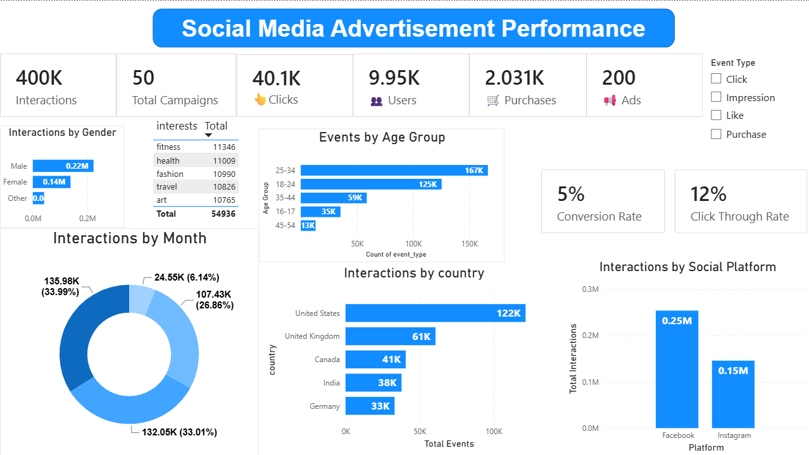

# 📊 Social Media Advertisement Performance Analysis

## 📌 Project Overview

This project focuses on analyzing social media advertisement performance using **MySQL Workbench** for data querying and **Power BI** for interactive dashboard creation. The objective is to evaluate advertising campaign effectiveness, identify high-performing audience segments, and uncover actionable insights that support data-driven marketing decisions.

By transforming raw advertising data into meaningful visualizations, this project demonstrates how business intelligence tools can be used to monitor campaign performance and optimize marketing strategies.

---

## 🎯 Objectives

* Analyze social media advertisement campaign performance.
* Clean and query the dataset using MySQL.
* Design an interactive Power BI dashboard.
* Monitor key marketing KPIs.
* Identify trends in user engagement and conversions.
* Provide business recommendations based on data insights.

---

## 🛠️ Tools & Technologies

* **MySQL Workbench** – Data cleaning, querying, and analysis
* **Power BI** – Dashboard creation and visualization
* **SQL** – Data extraction and transformation

---

## 📂 Project Workflow

### 1. Data Preparation

* Imported the dataset into MySQL.
* Cleaned missing and inconsistent values.
* Executed SQL queries to prepare data for visualization.

### 2. Data Analysis

Analyzed campaign performance using SQL by exploring:

* Advertisement impressions
* Clicks
* Click-Through Rate (CTR)
* Conversion Rate
* Return on Investment (ROI)
* Audience demographics
* Campaign performance by platform
* Cost metrics

### 3. Dashboard Development

Developed an interactive Power BI dashboard featuring:

* KPI Cards
* Bar Charts
* Line Charts
* Pie & Donut Charts
* Slicers for interactive filtering
* Trend Analysis
* Campaign Performance Comparison

---

## 📊 Dashboard Highlights

The dashboard provides insights into:

* 📈 Total Impressions
* 🖱️ Total Clicks
* 🎯 Click-Through Rate (CTR)
* 💰 Advertising Spend
* 📦 Conversions
* 📊 Return on Investment (ROI)
* 👥 Audience Distribution
* 📅 Campaign Performance Over Time
* 📱 Platform-wise Performance

---

## 🔍 Key Business Insights

* Identified the highest-performing advertising campaigns.
* Compared campaign performance across different platforms.
* Analyzed user engagement trends over time.
* Evaluated conversion performance for various audience segments.
* Highlighted opportunities to optimize advertising spend.
* Enabled data-driven decision-making through interactive reporting.

---

## 📁 Repository Structure

```text
Social-Media-Advertisement-Performance/
│
├── social_media_query.sql
│
├── Social_Media_Advertisement_Performance.pbix
│
├── dashboard.png
│
└── README.md
```

> Update the folder names above to match your repository structure if they differ.

---

## 🚀 How to Use

### Clone the repository

```bash
git clone https://github.com/bchethan/Social-Media-Advertisement-Performance.git
```

### Open the project

1. Import the dataset into **MySQL Workbench**.
2. Execute the SQL scripts to prepare the data.
3. Open the `.pbix` file in **Power BI Desktop**.
4. Refresh the data source if necessary.
5. Explore the interactive dashboard.

---

## 📈 Dashboard Preview


### Dashboard Preview



---

## 💡 Skills Demonstrated

* SQL Query Writing
* Data Cleaning
* Data Transformation
* Relational Database Management
* Marketing Analytics
* KPI Analysis
* Business Intelligence
* Data Visualization
* Dashboard Design
* Insight Generation

---

## 🔮 Future Enhancements

* Add real-time data integration.
* Include additional marketing KPIs.
* Build advanced DAX measures.
* Enhance dashboard interactivity with drill-through pages.
* Publish the dashboard using the Power BI Service.

---

## 📄 License

This project is intended for educational and portfolio purposes.

---
## 👤 Author
**Chethan B**
* GitHub: https://github.com/bchethan
---
⭐ If you found this project helpful, consider giving it a star!
